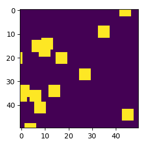
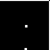

# deepq-collision-avoidance
deep q learning applied to collision avoidance

# todo

- ~~add experience replay (last n frames)~~
- ~~test blitting using matplotlib (it is way faster)~~
    - 
- ~~gpu acceleration~~

# helping it learn

currently the problem is that the sampling of rewards causes the agent not to learn the general Q function (too many +1s, -1s are sparse)

- tweak reward r_n to be relative to distance (?)
- tweak exploration
- run it for longer (and on the GPU, let the memory get up to 1m+)
- make the boundaries another input feature (separate tensor), or encode the distance to each one (?)
- make the player's position (x, y) normalized from 0 to 1 as an input feature?
    - should still be able to learn that it's always in the center though
    
- ensure the distribution of +1 rewards to -1 rewards matches in sampling
    - OR, just tweak the reward function so that the distribution for both is similar
    - -1 if moving forward that way for N timesteps collides with an enemy and +1 if it doesn't
    - [HER?](https://becominghuman.ai/learning-from-mistakes-with-hindsight-experience-replay-547fce2b3305_) (hindsight experience replay)
        - there is also [PER](https://medium.freecodecamp.org/improvements-in-deep-q-learning-dueling-double-dqn-prioritized-experience-replay-and-fixed-58b130cc5682)
    - [convnetjs](https://cs.stanford.edu/people/karpathy/convnetjs/demo/rldemo.html)
    - make the -1 reward more likely
    
# log 
- feb 27: implemented frame stacking and started training on `50x50x4` inputs, if it doesn't learn still and there are no bugs just reduce the input state size to `36x4` (the many different lines). also implemented gpu acceleration, and realized my last layer's activation wasn't nonlinear so the reward function couldn't grow indefinitely!!
- feb 28: yay! tested it on the 5th checkpoint and it turns out that it learns to dodge a little. but it keeps on hitting the border so i'm going to change the environment so that the entities spawn around the player but it can move indefinitely around the scene (ignore the border). alternatively we can just give a reward of -1 for colliding with the border.
- feb 28: after training for 7 more hours the agent performs way better than the previous iteration and demonstrates dodging behaviour which is good
- mar 3:  trained for about a day 
    - 
    - i noticed it clips a lot of the entities because technically it'll clip for like max 3 seconds and lose a bit of reward to increase expected future reward but it makes that tradeoff a lot so it doesnt entirely avoid obstacles, making the punishment larger would make these outcomes less likely to be chosen (since our policy chooses the max)
    - the reward for living is +1 and colliding is -1 so it should be like -5 or even worse for colliding..not sure
    - intuitively it should be worse for it to collide with 2 obstacles overlapping each other but .. it doesn't take that into account

one thing I realized is that I should test it on lower input sizes, so currently it's `50x50x4` and the stacked frame buffer takes up ~`0.08mb` per experience so  ~`6gb` memory is required for the full `76800` experiences in the replay buffer.